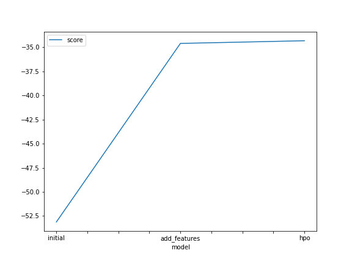
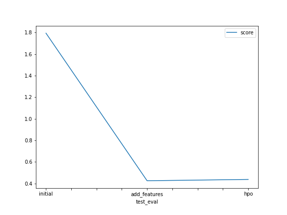

# Report: Predict Bike Sharing Demand with AutoGluon Solution
#### Geoffroy Akotia

## Initial Training
### What did you realize when you tried to submit your predictions? What changes were needed to the output of the predictor to submit your results?
To be able to submit our predictions, we cannot have negative values in our predicted values. Therefore, if it is the case we have to set the values to 0.

### What was the top ranked model that performed?
The `WeightedEnsemble` at the second stack level was our best performing model.

## Exploratory data analysis and feature creation
### What did the exploratory analysis find and how did you add additional features?
The EDA help us a lot to imporve our model. Not only we used it to convert the the proper object type features to category type
which help the model better process them during preprocessing but the parsing of the datetime column was also key.
Indeed, we extracted from the datetime column the year, month, day of the week and hour to be able to better narrow down when people were
using bikes and also with the help of variable such as season, workingday, holiday and related to the weather we could cross all those to better
help the model find the pattern that tend to push people to rent bikes. Therefore, it's not surprising that tree base models and ensemble models with the tree base model
did so well. Also, adding the hour feature was key as the need for a vehicule is also related to the time of the day. Especially in a city. We need it more at lunch time
that in the middle of the night for exemple.
### How much better did your model preform after adding additional features and why do you think that is?
The model clearly performed better. We went from a RMSE on the train data of 53.11 to 35.19 with the new features and we have a similar case on the test data were the RMSLE
went from 1.79390 to 0.42599. On the train data we have in average a 33% improvement of our model and on the test data a 23.74% improvement.
## Hyper parameter tuning
### How much better did your model preform after trying different hyper parameters?
The model did not perform that better with hyperparameter tuning. Indeed, the score on the test data went from  0.42599 to 0.43812. This is not that surprising as what make Autogluon that powerfull is that it's does not use CASH. The idea is that the more HPO we perform on the validation data, the more we introduce a biais in the model we are tuning as the different base models are then trying to be better and better on the validation data. We do reduce that case a lot with the use of k-fold bagging but it's still there. We can see that in effect in the fact that the hpo model do slightly better on the train data than the best model without it but in trade off do worst on the test data (-34.603943 vs -34.326635). Also, the idea behind Autogluon Tabular is to have a bunch of weak learners that by themselves are weak and full of random biais but when they come together in the ensemble models, they are better because they complete each other.
### If you were given more time with this dataset, where do you think you would spend more time?
We could look into doing some feature engineering on the hour feature. We could put them in classes because to be fair we can clearly see that we could group some hours of the day to
better reflect people use of bikes. This would be very helpfull for our tree base models that are the top performing ones for exemple. Also, we could look into training just on less models.
We could also look into tuning but not for all models. We need weak learners.

### Create a table with the models you ran, the hyperparameters modified, and the kaggle score.
|model|hyperparameters|hyperparameter_tune_kwargs|score|
|--|--|--|--|
|initial|default|None|1.79390|
|add_features|default|None|0.42599|
|hpo|default|auto|0.46288|
### Create a line plot showing the top model score for the three (or more) training runs during the project.

### Create a line plot showing the top kaggle score for the three (or more) prediction submissions during the project.

## Summary
To summarize, the key to improve our model was the feature engineering of our object type variables and of the datetime variable. This helped us better narrow down the pattern of the bike renting which we could clearly see in
the improvement of the performance of the model when the new features were added. Also, the best_quality presets is quite powerfull even with a small amount of time for the training.  
Also, even though HPO is powerfull, we should pay attention to not abuse it as it could introduce biais into our base models.